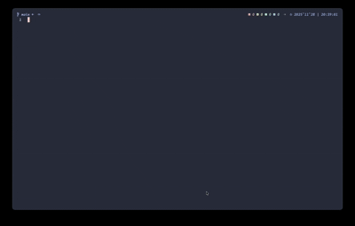

# Synapse.nvim

A modern, lightweight plugin manager for Neovim with a beautiful UI and intelligent dependency management.



## Features

- 📦 **Configuration-based Management**: Manage plugins through simple Lua configuration files
- 🔗 **Automatic Dependency Resolution**: Automatically install, update, and protect plugin dependencies
- 🌿 **Branch Support**: Clone specific branches for each plugin
- 🎨 **Beautiful UI**: Real-time progress display with customizable ASCII art headers
- ⚡ **Smart Updates**: Check for updates before applying them
- 🧹 **Auto Cleanup**: Remove unused plugins automatically

## Installation

```bash
git clone https://github.com/OriginCoderPulse/synapse.nvim ~/.local/site/package/pack/synapse.nvim
```

## Quick Start

Add to your Neovim configuration:

```lua
require('synapse').setup({})
```

## Configuration

### Basic Setup

```lua
require('synapse').setup({
    -- Git clone method: "ssh" or "https"
    method = "https",

    opts = {
        -- Plugin installation directory
        package_path = "your pkg path",
        
        -- Configuration directory (scanned recursively for .lua files)
        config_path = "your config path",
        
        -- UI customization
        ui = {
            style = "float",
            header = {
                text = {
                    "███████╗██╗   ██╗███╗   ██╗ █████╗ ██████╗ ███████╗███████╗",
                    "██╔════╝╚██╗ ██╔╝████╗  ██║██╔══██╗██╔══██╗██╔════╝██╔════╝",
                    "███████╗ ╚████╔╝ ██╔██╗ ██║███████║██████╔╝███████╗█████╗  ",
                    "╚════██║  ╚██╔╝  ██║╚██╗██║██╔══██║██╔═══╝ ╚════██║██╔══╝  ",
                    "███████║   ██║   ██║ ╚████║██║  ██║██║     ███████║███████╗",
                    "╚══════╝   ╚═╝   ╚═╝  ╚═══╝╚═╝  ╚═╝╚═╝     ╚══════╝╚══════╝",
                },
                hl = "SynapseHeader",  -- or use hex color: "#e6d5fb"
            },
            plug = {
                hl = "SynapsePlugin",  -- or use hex color: "#d5fbd9"
            },
            icons = {
                download = { glyph = "", hl = "SynapseDownload" },  -- or "#fbe4d5"
                upgrade = { glyph = "󰚰", hl = "SynapseUpgrade" },
                remove = { glyph = "󰺝", hl = "SynapseRemove" },
                check = { glyph = "󱥾", hl = "SynapseCheck" },
                success = { glyph = "", hl = "SynapseSuccess" },  -- or "#bbc0ed"
                faild = { glyph = "󰬌", hl = "SynapseFaild" },  -- or "#edbbbb"
                progress = {
                    glyph = "",
                    hl = {
                        default = "SynapseProgressDefault",  -- or "#5c6370"
                        progress = "SynapseProgress",  -- or "#fbe4d5"
                    },
                },
            },
        },
    },
    
    keys = {
        download = "<leader>si",
        remove = "<leader>sr",
        upgrade = "<leader>su",
    },
})
```

### Plugin Configuration Files

Create `.lua` files in your `config_path` directory (supports subdirectories):

```lua
-- ~/.config/nvim/plugins/telescope.lua
return {
    -- Repository URL (required)
    repo = "nvim-telescope/telescope.nvim",
    
    -- Clone configuration (optional)
    clone_conf = {
        branch = "main",  -- Default: "main"
    },
    
    -- Tag version (optional, takes precedence over branch)
    tag = "v0.1.0",  -- Lock to specific tag version
    
    -- Post-install/update commands (optional)
    execute = {
        "make",
        "cargo build --release",
    },  -- Or use a single string: execute = "make"
    
    -- Dependencies (optional)
    depend = {
        "nvim-lua/plenary.nvim",
    },
    
    -- Plugin configuration function (optional)
    config = function()
        require("telescope").setup({
            -- Your configuration
        })
    end,
}
```

## Usage

### Commands

- `:SynapseDownload` - Install missing plugins
- `:SynapseUpgrade` - Update all plugins
- `:SynapseRemove` - Remove unused plugins
- `:SynapseError` - View error messages from failed operations (toggle window)

### Keymaps (default)

- `<leader>si` - Install plugins
- `<leader>sr` - Remove unused plugins
- `<leader>su` - Update plugins

## UI Features


### Progress Window

- **Header**: Customizable multi-line ASCII art (centered)
- **Plugin List**: Shows up to 10 plugins at a time with dynamic scrolling
- **Progress Bar**: Visual progress indicator with customizable colors
- **Status Icons**: Different icons for pending, active, success, and failed states

### Window Controls

- `q` or `Esc` - Close window
- `R` - Retry failed operations (when viewing failures)

### Error Window

When operations fail, error information is automatically saved. Use `:SynapseError` to view all error messages:

- **Format**: Errors are displayed in Markdown format
  - Plugin name as level 1 heading (`# PluginName`)
  - Error message using error admonition syntax (`> [!ERROR]`)
- **Window**: 
  - Same size as install/update windows (70% width, 60% height)
  - Title: " Synapse Error " (centered)
  - Buffer name: `SynapseError`
  - Filetype: `markdown` (for syntax highlighting)
- **Features**:
  - Automatically wraps long error messages
  - Removes trailing empty lines
  - Toggle with `:SynapseError` command (opens if closed, closes if open)
  - Errors are cleared when retrying operations (press `R` to retry)
- **Controls**:
  - `q` or `Esc` - Close error window
```

## Configuration Options

### `method`

- **Type**: `string`
- **Default**: `"https"`
- **Values**: `"ssh"` or `"https"`
- **Description**: Git clone protocol

### `opts.default`

- **Type**: `string`
- **Default**: `"OriginCoderPulse/synapse.nvim"`
- **Description**: Default plugin repository

### `opts.package_path`

- **Type**: `string`
- **Default**: `~/.synapse/package`
- **Description**: Directory where plugins are installed

### `opts.config_path`

- **Type**: `string`
- **Default**: `~/.config/nvim`
- **Description**: Directory to scan for plugin configuration files (recursive)

### `opts.ui`

- **Type**: `table`
- **Description**: UI customization options

#### `opts.ui.header`

- **Type**: `table`
- **Fields**:
  - `text`: Array of strings for multi-line ASCII art header
  - `hl`: Highlight group name or hex color (e.g., `"SynapseHeader"` or `"#e6d5fb"`)

#### `opts.ui.plug`

- **Type**: `table`
- **Fields**:
  - `hl`: Highlight group name or hex color for plugin names (e.g., `"SynapsePlugin"` or `"#d5fbd9"`)

#### `opts.ui.icons`

- **Type**: `table`
- **Description**: Icon definitions for different operations
- **Fields for each icon**:
  - `glyph`: Icon character (string)
  - `hl`: Highlight group name or hex color (e.g., `"SynapseDownload"` or `"#fbe4d5"`)

**Note**: All `hl` parameters support both highlight group names (strings) and hex color values (e.g., `"#bbc0ed"`). When a hex color is provided, a highlight group is automatically created.

## Dependency Management

Synapse automatically handles plugin dependencies:

1. **Auto-install**: Dependencies are installed automatically
2. **Deduplication**: Shared dependencies are installed only once
3. **Priority**: If a dependency is also a main plugin, its configuration takes precedence
4. **Protection**: Dependencies are protected during removal unless unused

## Version Management

Synapse supports both branch and tag-based version control:

- **Tag Support**: Use `tag` field in plugin configuration to lock to a specific version
  - When `tag` is specified, it takes precedence over `branch`
  - Tag information is saved to `synapse.yaml` for persistence
  - Updates will respect tag changes in configuration

- **Branch Support**: Use `clone_conf.branch` to specify a branch
  - Default branch is "main" if not specified
  - Branch information is saved to `synapse.yaml` (only if not "main" or "master")

- **synapse.yaml**: Automatically created in `package_path` directory
  - Records installed plugins with their repository, branch, tag, and dependencies
  - Only main plugins are recorded (dependencies are stored in `depend` field)
  - Used to maintain consistency across installations and updates

- **Post-Install Commands**: Use `execute` field to run build commands
  - Commands are executed after successful Git clone/update
  - Supports both installation and update operations
  - Commands run in the plugin's installation directory
  - Useful for compiled plugins that require build steps

## Examples

### Basic Plugin

```lua
-- ~/.config/nvim/plugins/mason.lua
return {
    repo = "williamboman/mason.nvim",
    config = function()
        require("mason").setup()
    end,
}
```

### Plugin with Dependencies

```lua
-- ~/.config/nvim/plugins/telescope.lua
return {
    repo = "nvim-telescope/telescope.nvim",
    depend = {
        "nvim-lua/plenary.nvim",
        "nvim-telescope/telescope-live-grep-args.nvim",
    },
    config = function()
        require("telescope").setup({})
    end,
}
```

### Plugin with Custom Branch

```lua
-- ~/.config/nvim/plugins/custom.lua
return {
    repo = "username/repo-name",
    clone_conf = {
        branch = "develop",
    },
    config = function()
        -- Your config
    end,
}
```

### Plugin with Tag Version

```lua
-- ~/.config/nvim/plugins/versioned.lua
return {
    repo = "username/repo-name",
    tag = "v1.2.3",  -- Lock to specific tag version
    config = function()
        -- Your config
    end,
}
```

**Note**: When `tag` is specified, it takes precedence over `branch`. The plugin will be checked out to the specified tag version, and this tag will be recorded in `synapse.yaml` for future reference.

### Plugin with Post-Install Commands

```lua
-- ~/.config/nvim/plugins/compiled.lua
return {
    repo = "username/compiled-plugin",
    execute = {
        "make",
        "cargo build --release",
    },  -- Commands executed sequentially after installation/update
    config = function()
        -- Your config
    end,
}
```

Or use a single command:

```lua
return {
    repo = "username/compiled-plugin",
    execute = "make",  -- Single command
    config = function()
        -- Your config
    end,
}
```

**Note**: The `execute` field supports both a single string or an array of strings. Commands are executed sequentially in the plugin's installation directory. If any command fails, the installation/update process will stop and report an error.

**Common Use Cases**:
- **Compiled plugins**: Use `make`, `cargo build`, `npm install`, etc.
- **Language servers**: Build and install language servers
- **Native extensions**: Compile native components
- **Post-install setup**: Run setup scripts or install dependencies

**Examples**:
```lua
-- C/C++ plugin with make
execute = "make"

-- Rust plugin with cargo
execute = "cargo build --release"

-- Node.js plugin
execute = "npm install"

-- Multiple build steps
execute = {
    "cmake .",
    "make",
    "make install",
}

-- Python plugin with pip
execute = "pip install -e ."
```

### Custom UI Colors

You can use hex colors directly in `hl` parameters:

```lua
require('synapse').setup({
    opts = {
        ui = {
            header = {
                text = { "Your Header" },
                hl = "#e6d5fb",  -- Use hex color directly
            },
            plug = {
                hl = "#d5fbd9",  -- Plugin name color
            },
            icons = {
                success = {
                    glyph = "✓",
                    hl = "#bbc0ed",  -- Success icon color
                },
                faild = {
                    glyph = "✗",
                    hl = "#edbbbb",  -- Failure icon color
                },
                progress = {
                    glyph = "▸",
                    hl = {
                        default = "#5c6370",  -- Default progress color
                        progress = "#fbe4d5",  -- Active progress color
                    },
                },
            },
        },
    },
})
```

Or use highlight group names:

```lua
require('synapse').setup({
    opts = {
        ui = {
            header = {
                text = { "Your Header" },
                hl = "SynapseHeader",  -- Use highlight group name
            },
            -- ... other config
        },
    },
})
```

## Troubleshooting

### Plugins Not Recognized

- Ensure configuration files are in `config_path` (supports subdirectories)
- Check that files return a table with a `repo` field
- Verify `repo` field is not empty

### Dependencies Not Installed

- Check `depend` field format (array of strings)
- Verify repository URLs are correct
- Check network connectivity

### Permission Issues

- Ensure Neovim has write permissions in `package_path`
- Check directory ownership

### Network Issues

- Verify internet connectivity
- Check GitHub accessibility
- Verify SSH keys (if using SSH method)

### Execute Commands Fail

- Ensure the required build tools are installed (make, cargo, npm, etc.)
- Check that the plugin directory contains the necessary build files
- Verify the command syntax is correct
- Check file permissions in the plugin directory
- Review error messages in the UI for specific command failures
- Use `:SynapseError` command to view detailed error messages
- Some commands may require additional environment variables or PATH settings

### Viewing Error Messages

- Use `:SynapseError` command to view all error messages from failed operations
- Error messages are displayed in Markdown format with full content (no truncation)
- Errors are automatically saved when operations fail
- Error cache is cleared when retrying operations (press `R` in the progress window)
- Error window can be toggled with `:SynapseError` command

## Contributing

Contributions are welcome! Please feel free to submit issues or pull requests.

## License

MIT License
